[LinkedIn](http://se.linkedin.com/in/jonatanjoensson)

[Curriculum Vitae](binaries/Jonatan_Jonsson_eng_CV.pdf) (as PDF)

 [Peltarion](https://www.peltarion.com) is an operational AI platform for designing, training, evaluating and deploying neural networks. I helped out with making it scale better and integrating it with various other services, such as Google sheets. 

**Keywords**: Java, Python, Keras, Tensorflow, Google Cloud, Azure, Machine learning, ML, Deep learning, AI

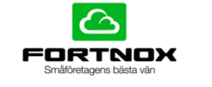 Was the software architect for [Fortnox Finans](https://www.fortnox.se) which have brought factoring into the 21st century. Took two years to B/E. Initial investment (6 million SEK) is now profited every 4 months (2019) 

**Keywords**: Dropwizard, jersey, jetty, guice.

 Maintained [EMMA](http://software.sonymobile.com/emma/) and Update Engine for [Sony Mobile](https://www.sony.com). Keywords: Java, OSGI, Eclipse RCP, Ant, Git, Gerrit, Jira

 Helped [IST](https://www.ist.com/se/) port their school system, Dexter, from C++ into Java.

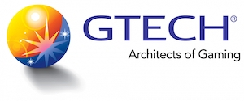 Maintained Gtech-G2's Gaming Management System. It is the inner core of their eco-system. It handles the players finances, simply put it works like a bank for games. It's also their centerpiece in setting responsible gaming limits. 
**Keywords**: Java, Spring, Hibernate, JIRA, Subversion, Jenkins, Ant

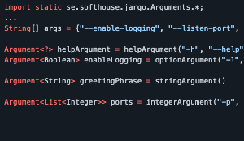 I created and open sourced [Jargo](https://github.com/jontejj/jargo) which is a command line parser for Java.

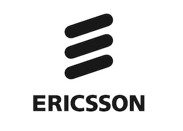 [Ericsson Charging System](http://www.ericsson.com/) (the Service Data Point part) is a system for real-time rating of pre-paid calls, handling 1.4 billion subscribers.

**Keywords**: Telecom, Bug-squashing, Java, C++, Clearcase, Reviewboard.org, Hudson, SCONS, TimesTen, Solaris, Kanban

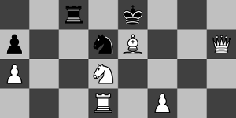 A [chess](binaries/chess.jar) game written in Java using the Apache batik SVG library for the graphics and Google's Guava library for efficiency. [Source Code](https://github.com/jontejj/chess-svg)

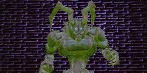  Dungeon Shooter: A First Person Shooter where you control a Hero fighting against the evil Monster named Ifrit. If Ifrit eats you up, you get dizzy and if you shoot him (with space or left mouse button) he reappears some place else. If you test pressing the F1-F7 buttons you will notice some effect changes. [download link](binaries/Dungeon3D.zip)

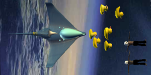 DawgShower3D: A cool project from a cool course called "Multicore and GPU Programming for Video Games"- It is written for the Xbox 360 using the XNA framework. [download link](binaries/DawgShower3D.zip)

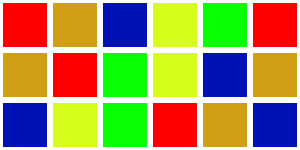 Tetris: An improved version of Tetris where the bricks fall more realisticly. Using smart techniques you can score over 10 lines! [download link](binaries/Tetris.zip)

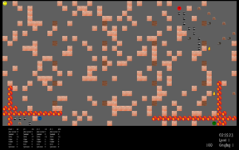 A game where each player has a certain amount of bombs to place at one time. Watch the chain reaction when you place bombs so they reach each other. You can play against each other on the same computer, using the network or just play against my super AI. [download link](binaries/BomberMan.zip)

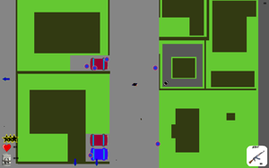 A Grand Theft Auto resembling game where it is easy to constuct your own levels. Not quite finished but the basic gameplay is there. [download link](binaries/GTA.zip)

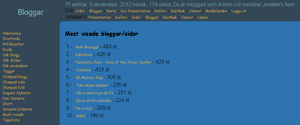 A complete solution if you want to host your own community. You got friends, tags, photo galleries with custom privileges, top lists and much more.

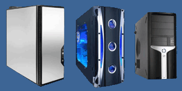 The result of a project I was project leader for at the John Bauer High School. Start building by dragging the computer parts to the right part of the application and drop them there to fit them into the computer. [link](binaries/virtualcomputerbuilder.swf)

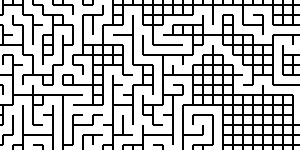 Amazing Maze: A game where you are supposed to reach the green goal. If you get lost you can press enter to blip your position. Written in C++ using the SDL framework. [download link](binaries/AmazingMaze.zip)

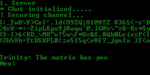 A chat client that uses AES to encrypt/decrypt transmissions and Diffie Hellman to establish the secret password. It uses random numbers so the user doesn't enter any passwords, it just works. (It does not protect against MITM attacks though) [download link](binaries/SecureChat.zip) User guide: [Here](binaries/securechat.txt)

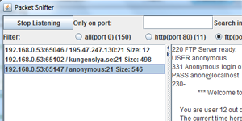 A tool that lets you capture and analyze network traffic easily with a nice GUI. Some predefined ports/applications are available such as MSN, FTP, email, HTTP etc. You can also filter and search all recorded traffic. You can also specify a specific port to listen to. Remember to follow the readme to install. [download link](binaries/JavaPacketSniffer.zip) 

# Archived projects

(not finished or completely revamped since I stopped working on it)

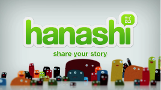 Developed an iPhone version of Sony Ericsson's chat client Hanashi. They were so pleased that they later hired (as consultants) me and two others to finish the work. (When WhatsApp took over the whole market, Sony decided to discontinue the project)

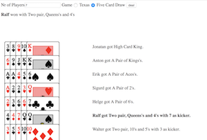 Poker simulator. The idea was to create a game but it's not finished yet :)

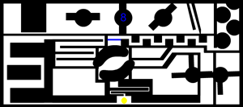 A game I made with Adobe Director (not available anymore)

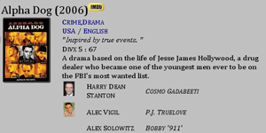 A massive index of most of my movies. I wrote the whole system using my knowledge in PHP/MySQL/CSS/Javascript. The movie info is scraped from IMDb using my own scraper. The GUI is under reconstruction. (i.e abandonded since Netflix appeared :))

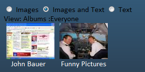 A page where you can upload images without hassling with stupid logins. You can set tags and albums on your images. Others can vote. Anyone can remove images unless you set a removal code. This project uses a lot of AJAX to speed up the browsing experience. (before imgur.com)

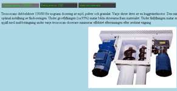  Tecnoscan Processteknik AB designs, sells, and manufactures individual components and complete facilities for all types of skilled handling of bulk materials. (they now use another site)

 A portfolio page I redesigned and made dynamic (easy to manage) for a composer named Tobias Broström. (site is now using wordpress instead)

 Lions is a nonprofit organization that me and Filip Sanden helped by redesigning their website. We also made it dynamic and easy to maintain. (site not available)
