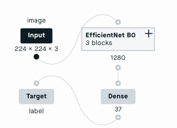

-  [Peltarion](peltarion.com) is an end-to-end platform for designing, training, evaluating and deploying neural networks. I helped out with making it scale better and integrating it with various other services, such as Google sheets. Keywords: Java, Python, Keras, Tensorflow, Google Cloud, Azure

-  
  Was the software architect for [Fortnox Finans](fortnox.se) which have brought factoring into the 21st century. Took two years to B/E. Initial investment (6 million SEK) is now profited every 4 months (2019) Keywords: Dropwizard, jersey, jetty, guice.

-  Maintained [EMMA](http://software.sonymobile.com/emma/) and Update Engine for [Sony Mobile](sony.com). Keywords: Java, OSGI, Eclipse RCP, Ant, Git, Gerrit, Jira

-  Helped [IST](https://www.ist.com/se/) port their school system, Dexter, from C++ into Java.

-  Maintained Gtech-G2's Gaming Management System. It is the inner core of their eco-system. It handles the players finances, simply put it works like a bank for games. It's also their centerpiece in setting responsible gaming limits. Keywords: Java, Spring, Hibernate, JIRA, Subversion, Jenkins, Ant

- I created and open sourced [Jargo](https://github.com/jontejj/jargo) which is a command line parser for Java.

-  [Ericsson Charging System](http://www.ericsson.com/ourportfolio/telecom-operators/ericsson-charging-system?nav=marketcategory007%7Csubarea014) (the Service Data Point part) is a system for real-time rating of pre-paid calls, handling 1.4 billion subscribers. Keywords: Telecom, Bug-squashing, Java, C++, Clearcase, Reviewboard.org, Hudson, SCONS, TimesTen, Solaris, Kanban

-  A [chess](https://raw.githubusercontent.com/jontejj/resume/master/docs/binaries/chess.jar) game written in Java using the Apache batik SVG library for the graphics and Google's Guava library for efficiency. [Source Code](https://github.com/jontejj/chess-svg)

-  Developed an iPhone version of Sony Ericsson's chat client Hanashi. They were so pleased that they later hired (as consultants) me and two others to finish the work.

- [Dungeon Shooter](https://raw.githubusercontent.com/jontejj/resume/master/docs/images/16Dungeon.png) [download link](https://raw.githubusercontent.com/jontejj/resume/master/docs/binaries/Dungeon3D.zip) A First Person Shooter where you control a Hero fighting against the evil Monster named Ifrit. If Ifrit eats you up, you get dizzy and if you shoot him (with space or left mouse button) he reappears some place else. If you test pressing the F1-F7 buttons you will notice some effect changes.
- And more!
